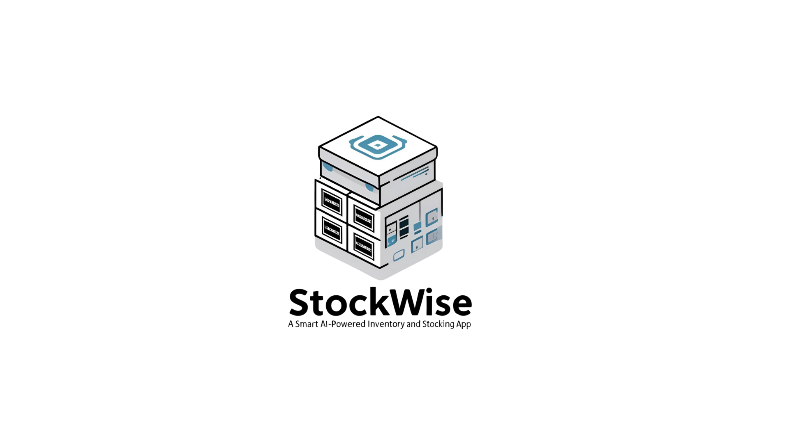

# 🟢 Pacman_HackForBusiness: Smart B2B/B2C Platform



Welcome to **Pacman_HackForBusiness**, a full-stack platform that connects businesses and consumers through smart inventory, credit, competition, and location-based services. This project leverages Django, Flask, Next.js, and advanced ML to create a seamless ecosystem for business management, consumer discovery, and AI-powered automation.

---

## 🚀 Overview

Pacman_HackForBusiness is a modular system with the following core components:

- **Backend (Django):** RESTful API for business/customer management, inventory, credits, and notifications.
- **Business Dashboard (React):** Modern dashboard for businesses to manage products, credits, competition, and notifications.
- **Consumer App (Next.js):** Interactive map for consumers to find products and businesses, and send notifications.
- **ML Services (Flask):** 
  - Product image matching and competition analysis using web scraping and torchvision.
  - Invoice and object detection using YOLOv8 and Google Gemini AI.

Each module is documented in detail in its own README. See links below for full API and usage documentation.

---

## 📦 Project Structure

```
Pacman_HackForBusiness/
│
├── backend/
│   └── myproject/
│       ├── myapp/           # Django app: models, views, urls
│       └── README.md        # Backend API documentation
│
├── frontend/
│   ├── Business/            # React dashboard for businesses
│   │   └── README.md        # Dashboard usage & API docs
│   └── consumer/            # Next.js app for consumers
│       └── README.md        # Consumer app usage & API docs
│
├── ml_sushma/               # ML: Product image matching & competition
│   └── README.md            # ML API usage & endpoints
│
├── ml_supriya/              # ML: Invoice & object detection
│   └── README.md            # Invoice API & detection docs
│
└── README.md                # (You are here) Project introduction
```

---

## 🛠️ Quick Start

### 1. Clone the repository

```sh
git clone <repo-url>
cd Pacman_HackForBusiness
```

### 2. Setup Each Module

- **Backend:**  
  See [backend/myproject/README.md](backend/myproject/README.md)

- **Business Dashboard:**  
  See [frontend/Business/README.md](frontend/Business/README.md)

- **Consumer App:**  
  See [frontend/consumer/README.md](frontend/consumer/README.md)

- **ML Product Matcher:**  
  See [ml_sushma/README.md](ml_sushma/README.md)

- **ML Invoice/Object Detection:**  
  See [ml_supriya/README.md](ml_supriya/README.md)

Each README contains detailed installation, configuration, and usage instructions for its module.

---

## 🖥️ Usage Instructions

- **Start the Django backend** for API and database.
- **Run the ML Flask APIs** for product matching and invoice detection.
- **Launch the Business Dashboard** for business-side management.
- **Launch the Consumer App** for consumer-side map and search.

See each module's README for exact commands and environment setup.

---

## 📚 Further Documentation

- [Backend API Documentation](backend/myproject/README.md)
- [Business Dashboard Usage & API](frontend/Business/README.md)
- [Consumer App Usage & API](frontend/consumer/README.md)
- [ML Product Matcher & Competition](ml_sushma/README.md)
- [ML Invoice & Object Detection](ml_supriya/README.md)

---

## 🤝 Contributing

1. Fork the repo
2. Work in a feature branch
3. Submit a pull request

---

## 📝 License

MIT License. See [LICENSE](LICENSE) for details.

---